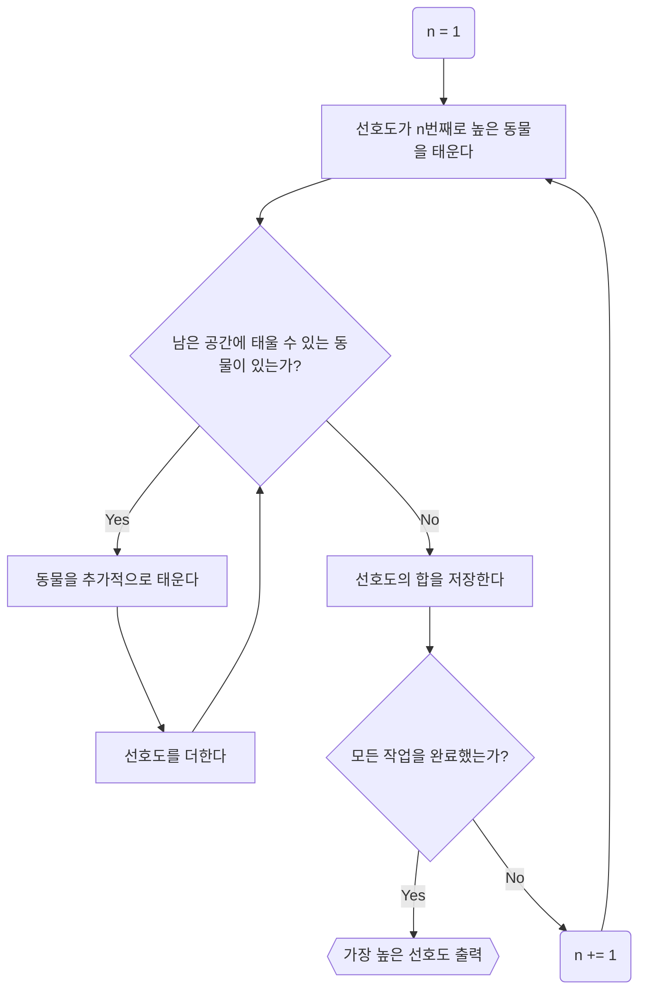
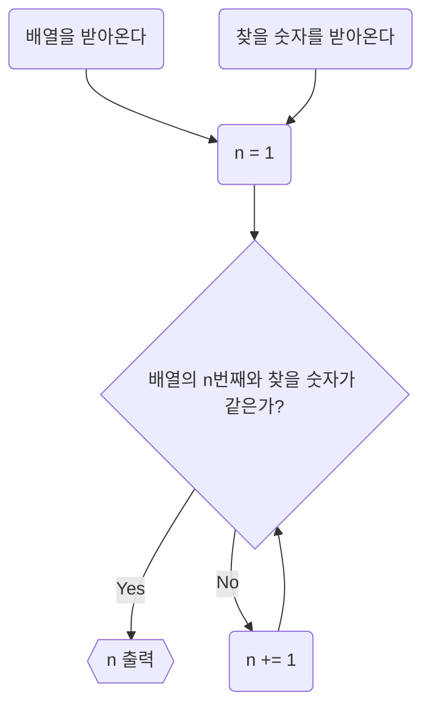
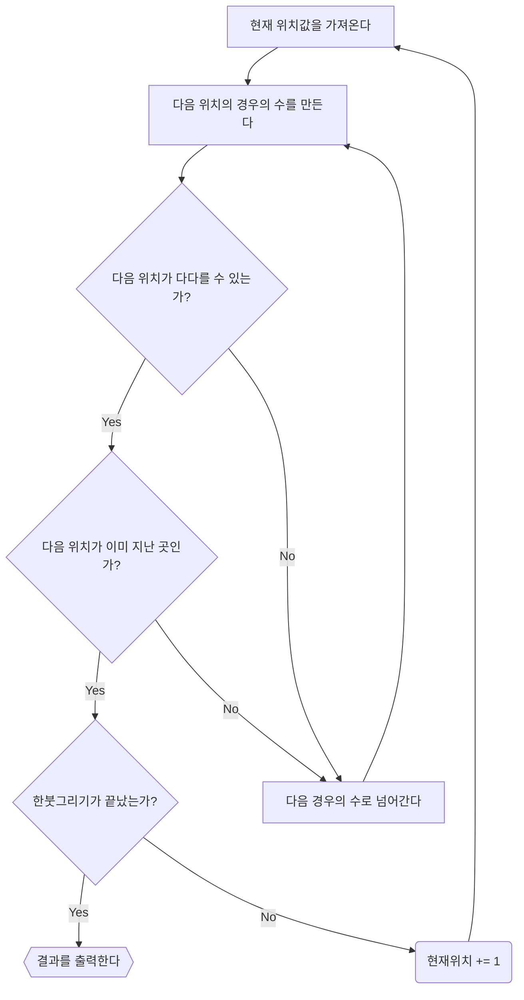
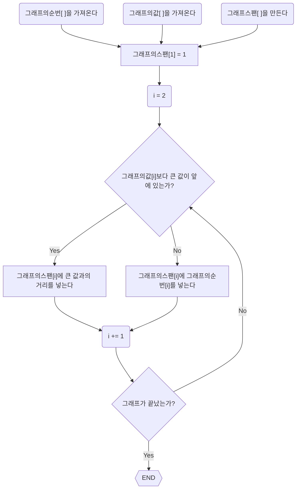
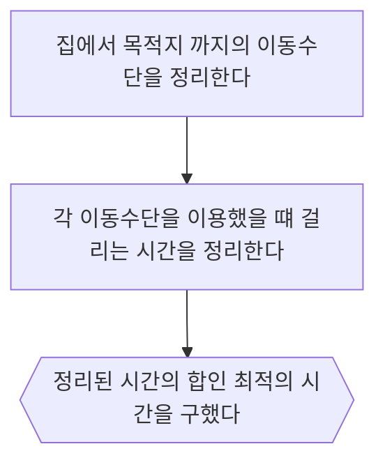

# Usecase


## 동물원

- 이벤트 흐름
  - 정상 흐름
    1. 가장 선호도가 높은 동물을 태운다.
    2. 남은 공간에 태울 수 있는 동물이 있는지 체크한다.
    3. 태울 수 있는 동물이 있을 경우, 동물을 추가적으로 태우고, 선호도를 더한다.
    4. 3이 불가능할 때 까지 반복하고, 최종 값을 저장한다.
    5. 다음으로 선호도가 높은 동물을 태우고, 2~4을 반복한다.
    6. 가장 선호도가 높은 값을 도출한다.
- 유스케이스 종료
  - 모든 작업을 완료했을 경우 종료된다.
- 사후 조건
  - X




## 85 찾기

- 이벤트 흐름
  - 정상 흐름
    1. 주어진 숫자를 받아와 저장한다.
    2. 찾을 값을 받아와 저장한다.
    3. 주어진 값의 리스트와 찾을 값을 하나하나 비교하며, 일치하는 좌표를 찾는다.
- 유스케이스 종료
  - 주어진 숫자와 찾을 값을 모두 비교했을 경우 종료된다.
- 사후 조건
  - X




## 한붓그리기

- 이벤트 흐름
  - 정상 흐름
    1. 현재 위치값을 가져온다.
    2. 다음 위치의 경우의 수를 만든다.
    3. 다음 위치가 다다들 수 있는 곳인지 체크한다. (E1)
    4. 다음 위치가 이미 지난 곳인지 체크한다. (E2)
    5. 다음 위치를 현재 위치로 저장하고, 1로 돌아가 한붓그리기가 완료될 때 까지 반복한다.
  - 선택 흐름
    - (E1) 다다를 수 없는 곳인 경우
      - 다음 경우의 수로 넘어간다.
    - (E2) 이미 지난 곳인 경우
      - 다음 경우의 수로 넘어간다.
- 유스케이스 종료
  - 한붓그리기가 완료되었을 경우 종료된다.
- 사후 조건
  - X




## 저울

1. 철수

   - 이벤트 흐름
     - 정상 흐름
       1. 가지고 있는 동전 중 하나를 랜덤으로 골라 저울에 올린다.
       2. 남은 동전을 순차적으로 반대에 올려 무게를 비교한다.
       3. 2를 반복하여 무게차이가 나는 동전을 찾아낸다.
   - 유스케이스 종료
     - 모든 동전을 비교하였을 경우 종료된다.
   - 사후 조건
     - X

   ```mermaid
   flowchart TD;
   	A(동전을 받아온다) --> B(n = 랜덤한 동전) --> C("m[ ] = 나머지 동전") -->D(i = 1) --> E{"n은 m[i]와 같은가?"}
   	E-->|No|G{{가짜 동전을 찾았다}}
   	E-->|Yes|F(i += 1) --> E
   ```

2. 영희

   - 이벤트 흐름
     - 정상 흐름
       1. 가지고 있는 동전을 2개씩 짝을 짓는다
       2. 짝이 된 동전 2개를 저울에 하나하나 올려가며 비교한다.
       3. 2를 계속해서 반복하다가 무게 차이가 나는 동전을 찾아낸다.
   - 유스케이스 종료
     - 모든 동전을 비교하였을 경우 종료된다.
   - 사후 조건
     - X

   ```mermaid
   flowchart TD;
   	A(동전을 받아온다) --> B("n[ ][2] = 랜덤한 한쌍의 동전") -->D(i = 1) --> E{"n[i][0]은 n[i][1]과 같은가?"}
   	E-->|No|G{{가짜 동전을 찾았다}}
   	E-->|Yes|F(i += 1) --> E
   ```

3. 광수
   - 이벤트 흐름
     - 정상 흐름
       1. 가지고 있는 동전을 반으로 나누어 2개의 동전 뭉치를 비교한다.
       2. 무게가 가벼운 뭉치를 다시 반으로 나누어 비교한다.
       3. 2의 내용을 반복하여 1개의 동전이 남을 때 까지 진행한다.
   - 유스케이스 종료
     - 모든 동전을 비교하였을 경우 종료된다.
   - 사후 조건
     - X
   
   ```mermaid
   flowchart TD;
   	A(동전을 받아온다) --> B(동전을 n과 m 두 그룹으로 나눈다) --> E{"n과 m중 무엇이 가벼운가?"}
   	G-->|No|B
   	E-->|m|F{m에는 1개의 동전만 있는가?}-->|Yes|K{{m이 가짜 동전}}
   	F-->|No|B
   	E-->|n|G{n에는 1개의 동전만 있는가?}-->|Yes|J{{n이 가짜 동전}}
   ```
   
   

## 주가 스팬

- 이벤트 흐름
  - 정상 흐름
    1. 그래프의 값과 순번을 가져온다.
    2. 1번 그래프는 앞선 값이 없기 때문에 1의 스팬을 부여한다.
    3. 다음 그래프의 앞에 이 그래프보다 큰 값이 있는지 찾는다. (E1)
    4. 3번을 마지막 그래프까지 반복한다.
  - 선택 흐름
    - (E1) 앞에 자신보다 큰 값이 있는 경우
      - 가장 가까운 큰 값과의 거리를 스팬으로 저장한다.
    - (E1) 앞에 자신보다 큰 값이 없는 경우
      - 자신의 순번을 스팬으로 저장한다.
- 유스케이스 종료
  - 모든 주가 스팬을 구했을 경우 종료된다.
- 사후 조건
  - X




## 등교 시간 분석

- 이벤트 흐름
  - 정상 흐름
    1. 집에서 목적지까지 겪는 이동수단을 정리한다.
    2. 각 이동수단을 이용했을 때 걸리는 시간을 정리한다.
    3. 정리 된 시간을 그대로 더한다.
- 유스케이스 종료
  - 최적의 시간을 찾았을 경우 종료된다.
- 사후 조건
  - X



