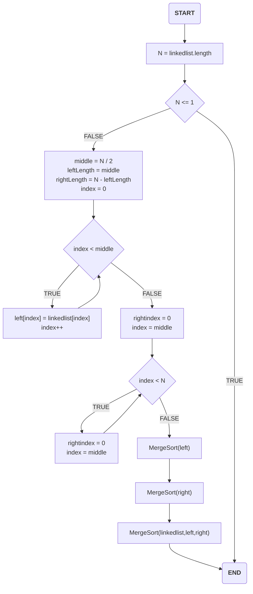
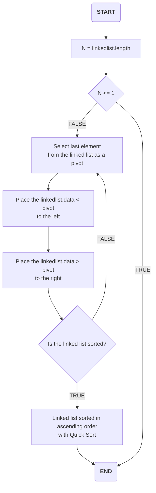
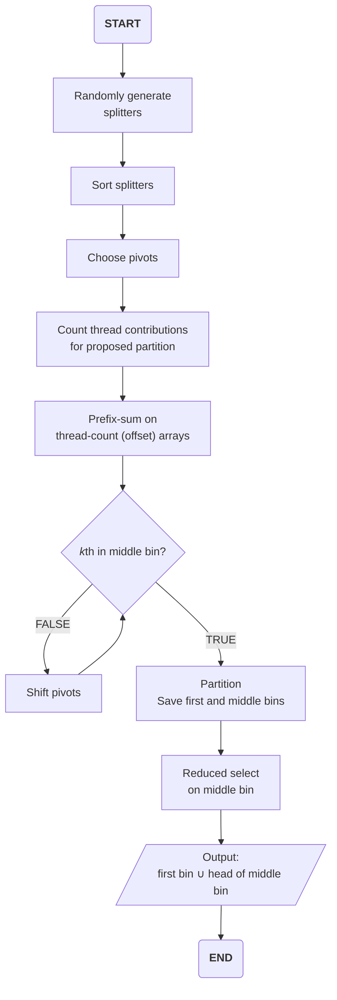
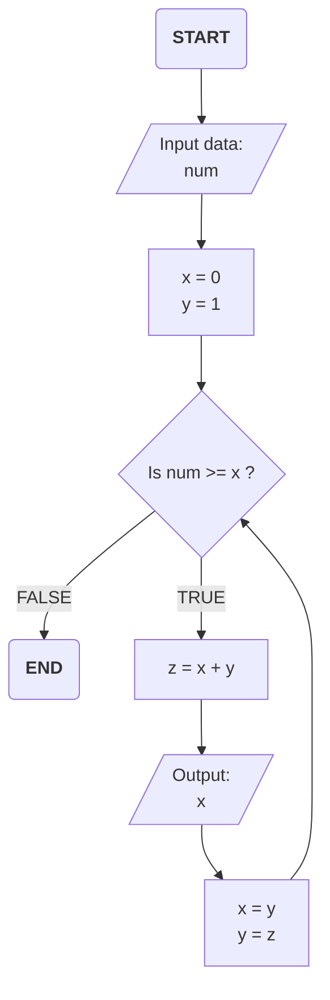

## Merge Sort Flowchart



## Quick Sort Flowchart



## Selection Algorithm Flowchart



## Closest Pair Algorithm Flowchart

```mermaid
flowchart TD;
	start(<b>START</b>)-->01[/"Input data:\n<b>(P<sub>0</sub>, S<sub>0</sub>),\n(P<sub>1</sub>, S<sub>1</sub>)</b>"/]
	01-->|"<b>P<sub>0</sub>, S<sub>0</sub></b>"|02[surface resanpling\n<b>u = <i>z</b></i>]
	02-->03["Choice of the trial\nparameters <b>(R<sub><i>t</i></sub>, T<sub><i>t</i></sub>)</b>"]
	03-->04["Surface resampling\n<b>u = <i>f</i>(R<sub><i>t</i></sub>, T<sub><i>t</i></sub>)</b>"]
	01-->|<b>P<sub>0</sub>, S<sub>0</sub></b>|04
	subgraph <b><i>DM</i></b>
        07[/"<b><i>σ<sub>n</sub>\nλ</i></b>"/]-->06
		04-->|"<b>ρ<sup>v</sup><sub>0<i>j</i></sub>(u)<b/>"|05["Compensation of\n<b>(R<sub><i>t</i></sub>, T<sub><i>t</i></sub>)</b>"]
		05-->|"<b>ρ'<sup>v</sup><sub>0<i>j</i></sub><b/>"|06[Mask creation by\nsamples comparison]
	end
	02-->|"<b>ρ<sup>v</sup><sub>0<i>j</i></sub>(z)<b/>"|08
	06-->|"<i>m<sub>j</sub></i><b>(R<sub><i>t</i></sub>, T<sub><i>t</i></sub>)</b>"|08[Cost estimation]
    08-->|"<i>C</i><b>(R<sub><i>t</i></sub>, T<sub><i>t</i></sub>)</b>"|09{Is the cost\nminimum?}
    09-->|TRUE|10[/"Output:\n<b>(P<sub>0</sub>, S<sub>0</sub>) = (R<sub><i>t</i></sub>, T<sub><i>t</i></sub>)</b>"/]
     
    01-->|<b>P<sub>1</sub>\nS<sub>1</sub></b>|11["Compensation of\n<b>(R<sub><i>t</i></sub>, T<sub><i>t</i></sub>)</b>"]
    11-->|"<b>P<sub>1</sub>(R<sub><i>t</i></sub>, T<sub><i>t</i></sub>)\nS<sub>1</sub>(R<sub><i>t</i></sub>, T<sub><i>t</i></sub>)</b>"|12[Surface resampling\n<b>u = <i>z</b>]
    12-->|"<b>ρ<sup>v</sup><sub>1<i>j</i></sub>(<i>z</i> | (R<sub><i>t'</i></sub>, T<sub><i>t</i></sub>)<b/>"|09
    
    09-->|FALSE|13("<b><i>Goto</i></b>\nChoice of the trial\nparameters <b>(R<sub><i>t</i></sub>, T<sub><i>t</i></sub>)</b>")
    
    10-->99(<b>END</b>)
```

## Fibonacci numbers Algorithm Flowchart



