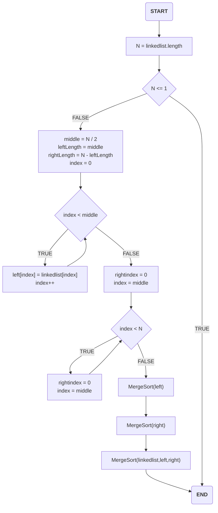
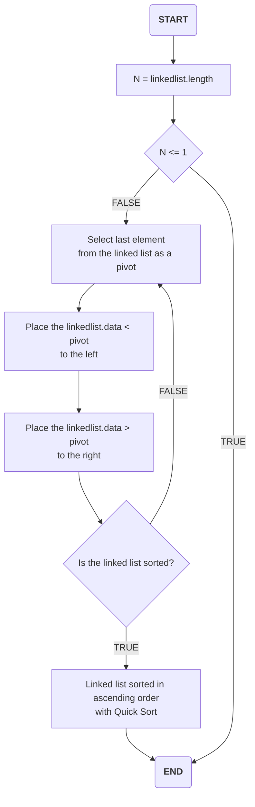
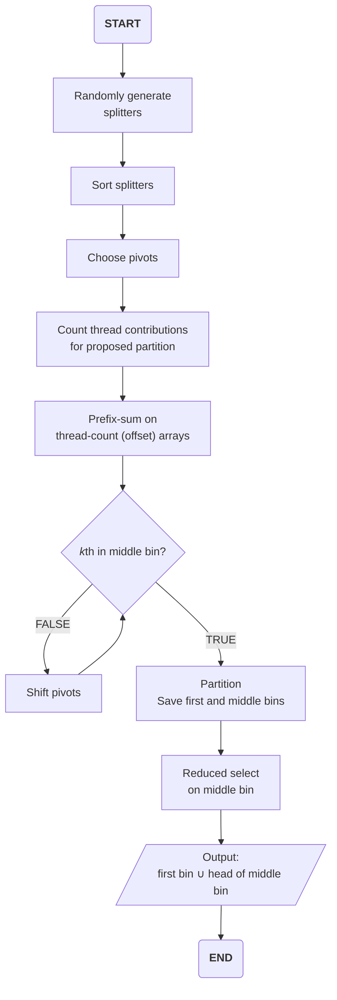
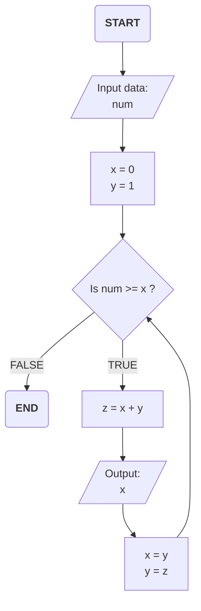

## Merge Sort Flowchart

- 이벤트 흐름
  - 정상 흐름
    1. 연결된 list를 반으로 나누고, 각각의 부분을 정렬합니다.
    2. 이를 반복하여 정렬을 한 뒤, 하나로 결합합니다.
- 유스케이스 종료
  - 모든 작업을 완료했을 경우 종료된다.
- 사후 조건
  - X



## Quick Sort Flowchart

- 이벤트 흐름
  - 정상 흐름
    1. 데이터의 마지막 요소를 pivot으로 설정합니다.
    2. pivot보다 작은 데이터를 왼쪽에 배치하고, 더 큰 데이터는 오른쪽에 배치합니다.
    3. 정렬이 되었는지 확인합니다.
    4. 정렬이 되지 않았을 경우, 다시 처음으로 돌아가 pivot을 설정하고 크기에 따라 배치하는 것을 반복합니다.
- 유스케이스 종료
  - 모든 작업을 완료했을 경우 종료된다.
- 사후 조건
  - X



## Selection Algorithm Flowchart

- 이벤트 흐름
  - 정상 흐름
    1. 랜덤한 숫자를 생성한다.
    2. 해당 숫자를 정렬한다.
    3. pivot을 선택한다.
    4. pivot과 자리를 바꾼다.
    5. pivot과 배열의 각 원소를 비교하여 작은 숫자를 왼쪽으로 옮기고, 큰 숫자를 오른쪽으로 옮긴다.
    6. 이를 반복하여 수를 찾는다.
- 유스케이스 종료
  - 모든 작업을 완료했을 경우 종료된다.
- 사후 조건
  - X



## Closest Pair Algorithm Flowchart

- 이벤트 흐름
  - 정상 흐름
    1. (P<sub>0</sub>, S<sub>0</sub>)와 (P<sub>1</sub>, S<sub>1</sub>)을 입력받는다.
    2. 우선 (P<sub>0</sub>, S<sub>0</sub>)을 u = <i>z</i>를 통해 표면 리셈플링을 진행합니다.
    3. 이후 trial parameter인 (R<sub><i>t</i></sub>, T<sub><i>t</i></sub>)를 가져옵니다.
    4. 그리고 ρ<sup>v</sup><sub>0<i>j</i></sub>(z)를 저장해둡니다.
    5. u = <i>f</i>(R<sub><i>t</i></sub>, T<sub><i>t</i></sub>)에 (P<sub>0</sub>, S<sub>0</sub>)와 3번째 단계의 값을 통해 표면 리셈플링을 진행합니다.
    6.  ρ<sup>v</sup><sub>0<i>j</i></sub>(u)를 보내 (R<sub><i>t</i></sub>, T<sub><i>t</i></sub>)로 Compensation합니다.
    7. σ<sub><i>n</i></sub>과 λ, 6에서 도출된 ρ'<sup>v</sup><sub>0<i>j</i></sub>의 샘플의 비교를 통한 마스크를 생성합니다.
    8. 이곳에서 도출된 <i>m<sub>j</sub></i>(R<sub><i>t</i></sub>, T<sub><i>t</i></sub>)과 저장해둔 4번째 단계의 값을 통해 계산합니다.
    9. (P<sub>1</sub>, S<sub>1</sub>)을 보내 (R<sub><i>t</i></sub>, T<sub><i>t</i></sub>)로 Compensation합니다.
    10. 여기서 도출된 P<sub>1</sub>(R<sub><i>t</i></sub>, T<sub><i>t</i></sub>)과 S<sub>1</sub>(R<sub><i>t</i></sub>, T<sub><i>t</i></sub>)을 u = <i>z</i>를 통해 표면 리셈플링을 진행합니다.
    11. 이후 만들어진 ρ<sup>v</sup><sub>1<i>j</i></sub>(<i>z</i> | (R<sub><i>t'</i></sub>, T<sub><i>t</i></sub>)과 8번째 단계에서 계산된 <i>C</i>(R<sub><i>t</i></sub>, T<sub><i>t</i></sub>)의 코스트가 최소인지 판별합니다.
    12. 만약 맞다면 (P<sub>0</sub>, S<sub>0</sub>) = (R<sub><i>t</i></sub>, T<sub><i>t</i></sub>)의 값을 보내고 마무리합니다.
    13. 아니라면 다시 trial parameter인 (R<sub><i>t</i></sub>, T<sub><i>t</i></sub>)을 선택하는 단계로 돌아가 반복합니다.
- 유스케이스 종료
  - 모든 작업을 완료했을 경우 종료된다.
- 사후 조건
  - X

```mermaid
flowchart TD;
	start(<b>START</b>)-->01[/"Input data:\n<b>(P<sub>0</sub>, S<sub>0</sub>),\n(P<sub>1</sub>, S<sub>1</sub>)</b>"/]
	01-->|"<b>P<sub>0</sub>, S<sub>0</sub></b>"|02[Surface resampling\n<b>u = <i>z</b></i>]
	02-->03["Choice of the trial\nparameters <b>(R<sub><i>t</i></sub>, T<sub><i>t</i></sub>)</b>"]
	03-->04["Surface resampling\n<b>u = <i>f</i>(R<sub><i>t</i></sub>, T<sub><i>t</i></sub>)</b>"]
	01-->|<b>P<sub>0</sub>, S<sub>0</sub></b>|04
	subgraph <b><i>DM</i></b>
        07[/"<b>σ<sub><i>n</i></sub>\nλ</b>"/]-->06
		04-->|"<b>ρ<sup>v</sup><sub>0<i>j</i></sub>(u)<b/>"|05["Compensation of\n<b>(R<sub><i>t</i></sub>, T<sub><i>t</i></sub>)</b>"]
		05-->|"<b>ρ'<sup>v</sup><sub>0<i>j</i></sub><b/>"|06[Mask creation by\nsamples comparison]
	end
	02-->|"<b>ρ<sup>v</sup><sub>0<i>j</i></sub>(z)<b/>"|08
	06-->|"<i>m<sub>j</sub></i><b>(R<sub><i>t</i></sub>, T<sub><i>t</i></sub>)</b>"|08[Cost estimation]
    08-->|"<i>C</i><b>(R<sub><i>t</i></sub>, T<sub><i>t</i></sub>)</b>"|09{Is the cost\nminimum?}
    09-->|TRUE|10[/"Output:\n<b>(P<sub>0</sub>, S<sub>0</sub>) = (R<sub><i>t</i></sub>, T<sub><i>t</i></sub>)</b>"/]

    01-->|<b>P<sub>1</sub>\nS<sub>1</sub></b>|11["Compensation of\n<b>(R<sub><i>t</i></sub>, T<sub><i>t</i></sub>)</b>"]
    11-->|"<b>P<sub>1</sub>(R<sub><i>t</i></sub>, T<sub><i>t</i></sub>)\nS<sub>1</sub>(R<sub><i>t</i></sub>, T<sub><i>t</i></sub>)</b>"|12[Surface resampling\n<b>u = <i>z</b>]
    12-->|"<b>ρ<sup>v</sup><sub>1<i>j</i></sub>(<i>z</i> | (R<sub><i>t'</i></sub>, T<sub><i>t</i></sub>)<b/>"|09

    09-->|FALSE|13("<b><i>Goto</i></b>\nChoice of the trial\nparameters <b>(R<sub><i>t</i></sub>, T<sub><i>t</i></sub>)</b>")

    10-->99(<b>END</b>)
```

## Fibonacci numbers Algorithm Flowchart

- 이벤트 흐름
  - 정상 흐름
    1. x = 0, y = 1로 세팅한다.
    2. num >= x일 경우 z에 z + y의 값을 넣고 x를 출력한다.
    3. 이후, x = y, y = z의 값을 대입하고, 2로 돌아간다.
    4. 2의 조건이 만족하지 않을 경우, 종료한다.
- 유스케이스 종료
  - 모든 작업을 완료했을 경우 종료된다.
- 사후 조건
  - X


