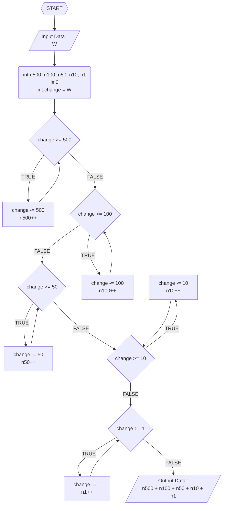
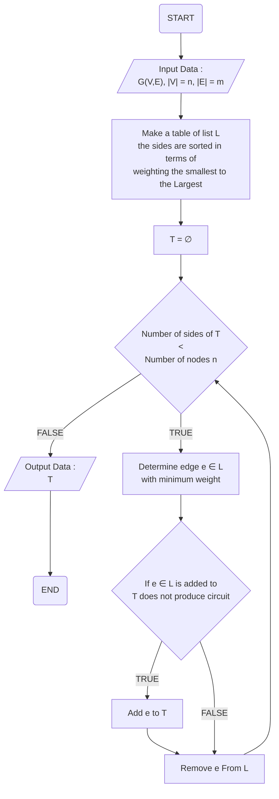
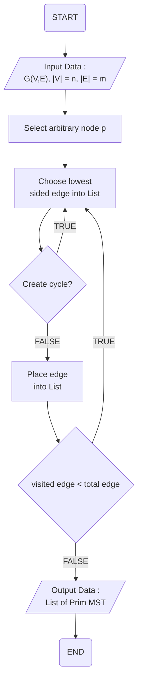
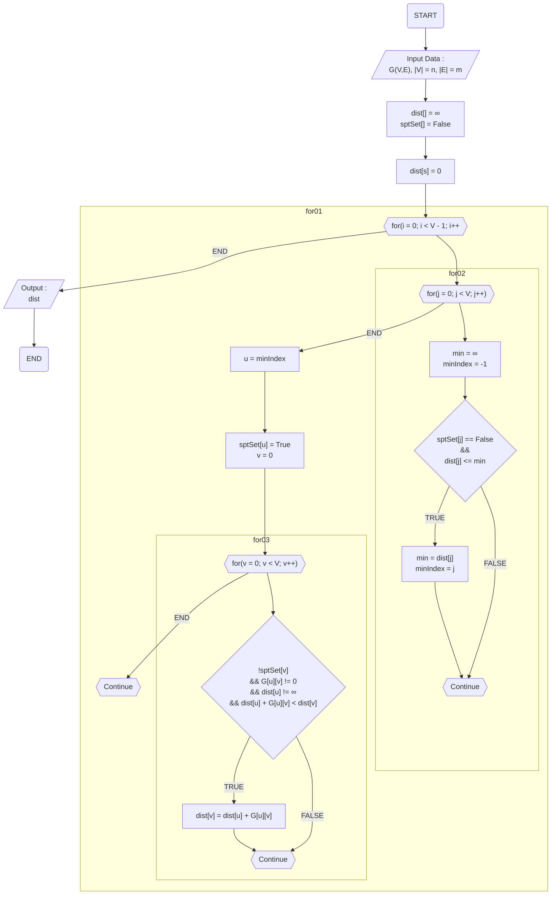
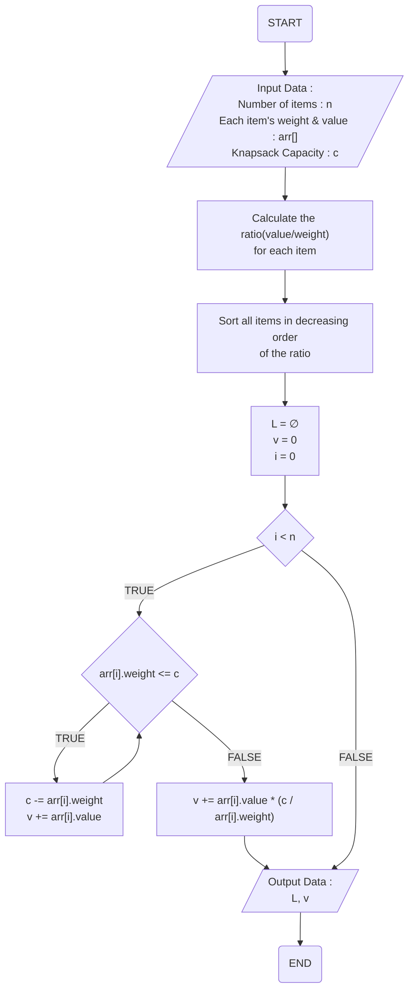

## Coin Change Algorithm

- 이벤트 흐름
  - 정상 흐름
    1. W를 입력받는다.
    2. 거슬러 받은 돈 W에서 500씩 빼며, 한번 빠질 때 마다 n500에 1을 더한다.
    3. 더 이상 500을 뺄 수 없을 경우, 100씩 빼며, 한번 빠질 때 마다 n100에 1을 더한다.
    4. 더 이상 100을 뺄 수 없을 경우, 50씩 빼며, 한번 빠질 때 마다 n50에 1을 더한다.
    5. 더 이상 50을 뺄 수 없을 경우, 10씩 빼며, 한번 빠질 때 마다 n10에 1을 더한다.
    6. 더 이상 10을 뺄 수 없을 경우, 1씩 빼며, 한번 빠질 때 마다 n1에 1을 더한다.
    7. W의 값이 0이 되어 모든 동전의 갯수가 나왔다면, n500, n100, n50, n10, n1을 모두 더한 값을 출력한다.
- 유스케이스 종료
  - 모든 작업을 완료했을 경우 종료된다.
- 사후 조건
  - X

## Kruskal MST Algorithm

- 이벤트 흐름
  - 정상 흐름
    1. 가중치에 따라 선분을 정렬합니다.
    2. 선분의 수가 노드의 수보다 작을 경우, 가장 작은 가중치를 가진 L의 원소 e를 선택합니다.
    3. L의 원소 E가 T에 추가되었을 때 사이클을 만들 지 않을 시, T에 e를 추가합니다.
    4. 이후 e를 L에서 지웁니다.
    5. 3에서 사이클을 만들 경우, e를 L에서 지우기만 합니다.
    6. 이후 3번째로 돌아가 반복합니다.
    7. 3번째에서 FALSE가 나올 경우, T를 출력하고 종료합니다.
- 유스케이스 종료
  - 모든 작업을 완료했을 경우 종료한다.
- 사후 조건
  - X

## Prim MST Algorithm

- 이벤트 흐름
  - 정상 흐름
    1. 랜덤한  노드를 선택하여 시작합니다.
    2. List에서 가장 작은 가중치를 가진 선분을 택합니다.
    3. 사이클의 생성을 확인하고, 사이클이 만들어졌다면, 다시 두번째로 돌아갑니다.
    4. 아닐 경우, List에 선분을 추가합니다.
    5. 방문한 선분이 전체 선분보다 작을 경우, 두번째로 돌아갑니다.
- 유스케이스 종료
  - 모든 작업을 완료했을 경우 종료한다.
- 사후 조건
  - X

## Dijkstra Algorithm 

- 이벤트 흐름
  - 정상 흐름
    1. 초기 노드 vs와 목표 노드 vn을 받아옵니다.
    2. P의 목표 노드는 0으로, T는 무한으로 초기화하며, i를 0으로 둡니다.
    3. 각각의 E의 원소인 v에 대하여, T(vi)는 min[T(vj), P(vj)+lij]입니다.
    4. 테이블인 P에 P(vi) = min[T(vi)]를 계산합니다.
    5. 이후 i+=1을 합니다.
    6. i가 V의 절댓값에 1을 뺀 것 보다 작을 경우, 3번째로 돌아가 반복합니다.
    7. 아닐 경우, P를 출력하고 종료합니다.
- 유스케이스 종료
  - 모든 작업을 완료했을 경우 종료한다.
- 사후 조건
  - X

## Fractional Knapsack Algorithm

- 이벤트 흐름
  - 정상 흐름
    1. 물건의 갯수 n, 각 물건의 무게와 가치 arr, 가방의 한계 c를 입력받는다.
    2. 각 물건의 무게당 가치를 계산한다.
    3. 무게당 가치를 기준으로 물건을 정렬한다.
    4. 물건의 리스트 L을 공집합으로 만들고, 배낭 속 물건의 가치의 합 v과 i를 0으로 초기화한다.
    5. i가 물건의 갯수보다 작을 시, arr[i]의 무게가 c보다 작은지 확인한다.
    6. 작거나 같을 시, c에서 arr[i]의 무게를 빼고, v에 arr[i]의 가치를 더한 뒤 5번재로 돌아간다.
    7. 클 시, v에 arr[i]의 가치에 c / arr[i]의 무게를 곱한 값을 더한다.
    8. i가 n보다 작지 않거나 7번째 프로세스가 끝났을 시, L과 v를 출력하고 종료한다.
- 유스케이스 종료
  - 모든 작업을 완료했을 경우 종료한다.
- 사후 조건
  - X

