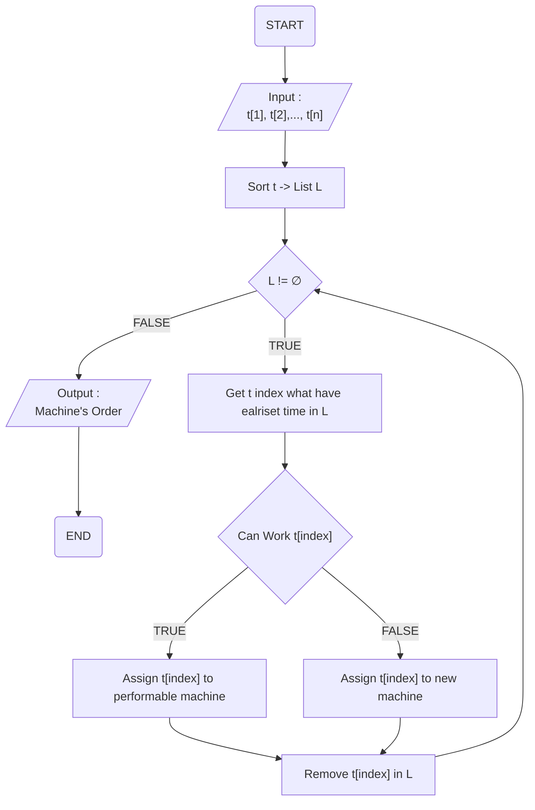
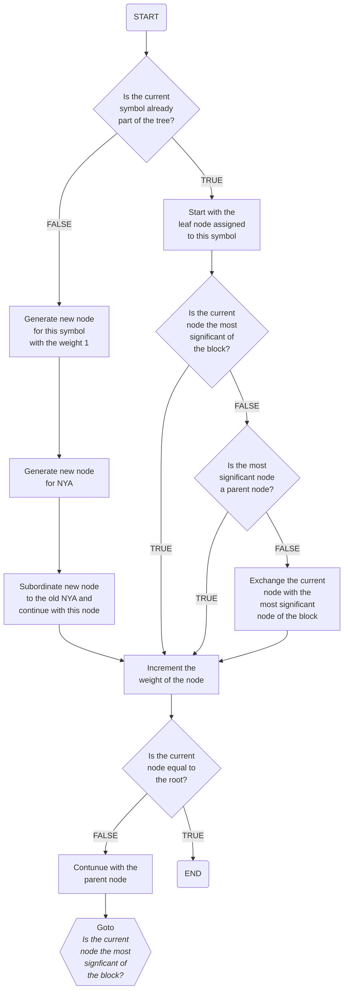
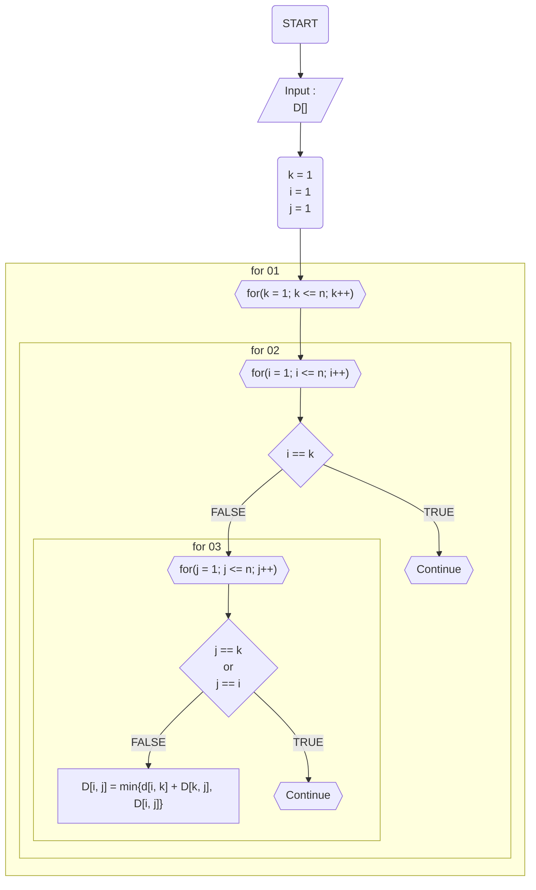
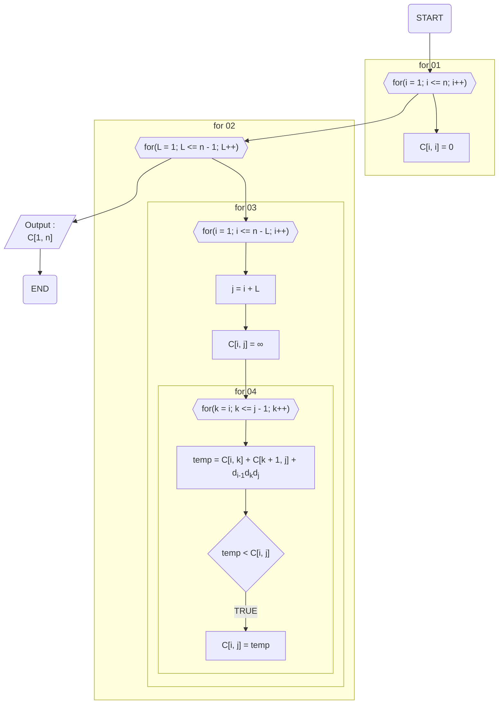

## Job Scheduling Algorithm

- 이벤트 흐름
  - 정상 흐름
    1. n개의 작업 t[]를 입력받는다.
    2. 시작시간의 오름차순으로 t[]를 정렬한 뒤, List L에 넣는다.
    3. L이 공집합이 아닐 경우, L에서 가장 이른 시작시간 작업인 t[index]를 가져온다.
    4. t[index]를 수행 가능한 기기가 있을 시, t[index]를 그 기계에 배정한다.
    5. t[index]를 수행 가능한 기기가 없을 시, t[index]를 새 기계에 배정한다.
    6. t[index]를 List L에서 제거한다.
    7. 3번째로 돌아가 반복한다.
    8. L이 공집합이 되었을 경우, 기계의 순서를 리턴한다.
- 유스케이스 종료
  - 모든 작업을 완료했을 경우 종료된다.
- 사후 조건
  - X

## Huffman Coding Algorithm

- 이벤트 흐름
  - 정상 흐름
    1. 현재 Symbol이 이미 Tree의 일부인지 체크
    2. 1번째가 참일 경우, 이 Symbol에 할당된 Leaf 노도르 시작
       1. 1번째가 거짓일 경우, 가중치가 1인 이 Symbol에 대한 새 노드 생성
       2. NYA에 대한 새 노드 생성
       3. 새 노드를 이전 NYA에 종속시키고 이 노드를 계속해서 진행
    3. 현재 노드가 블록 중 가장 중요한 노드인지 체크
    4. 3번째가 참일 경우, 노드의 가중치 증가
       1. 3번째가 거짓일 경우, 가장 중요한 노드가 상위 노드인지 체크
       2. 4-1번째가 참일 경우, 노드의 가중치 증가
          1. 4-1번째가 거짓일 경우, 현재 노드를 블록의 가장 중요한 노드와 교환
    5. 현재 노드가 root와 같은지 체크
    6. 5번째가 참일 경우 종료
       1. 5번째가 거짓일 경우, 상위 노드로 이어서 진행하고 3번째로 돌아감
- 유스케이스 종료
  - 모든 작업을 완료했을 경우 종료된다.
- 사후 조건
  - X

## All Pair Shortest Path Algorithm

- 이벤트 흐름
  - 정상 흐름
    1. D[]를 입력받음
    2. for(k = 1; k <= n; k++)를 실행한다.
       1. for(i = 1; i <= n; i++)를 실행한다.
          1. i == k일 경우, Continue 한다.
          2. for(j = 1; j <= n; j++)를 실행한다.
             1. j == k 이거나 j == i인 경우, Continue 한다.
             2. D[i, j] = min{d[i, k] + D[k, j], D[i, j]}를 진행한다.
    3. 모든 for가 종료되면, 완성된 D를 출력한다.
- 유스케이스 종료
  - 모든 작업을 완료했을 경우 종료된다.
- 사후 조건
  - X

## Matrix Chain Algorithm

- 이벤트 흐름
  - 정상 흐름
    1. i를 1에서 n까지 증가시키며 C[i, i]를 전부 0으로 채운다.
    2. L을 1에서 n - 1까지 증가시키며, 아래를 반복한다.
       1. i를 1에서 n - L까지 증가시키며, 아래를 반복한다.
          1. j를 i + L을 넣는다.
          2. C[i, j]에 ∞을 대입한다.
          3. k를 i에서 j - 1까지 증가시키며, 아래를 반복한다.
             1. temp에 C[i, k] + C[k + 1, j] + di-1dkdj를 넣는다.
             2. 만약 temp가 C[i, j]보다 작을 경우, C[i, j]에 temp를 넣는다.
    3. 모든 작업이 종료되었을 경우, C[1, n]을 출력한다.
- 유스케이스 종료
  - 모든 작업을 완료했을 경우 종료된다.
- 사후 조건
  - X

