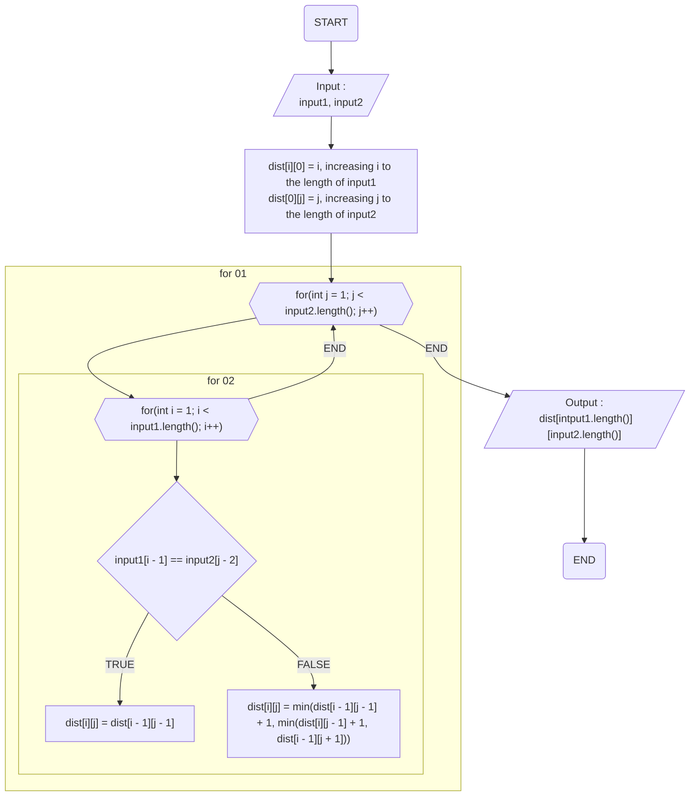
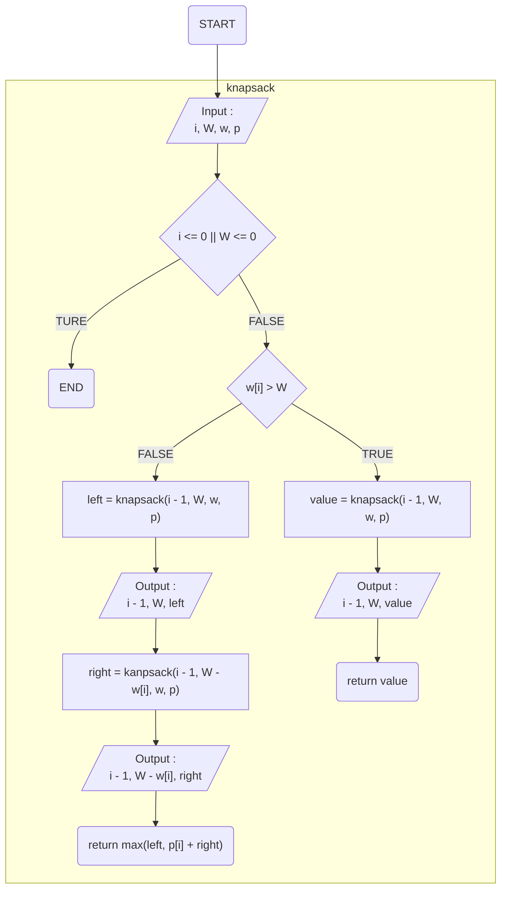
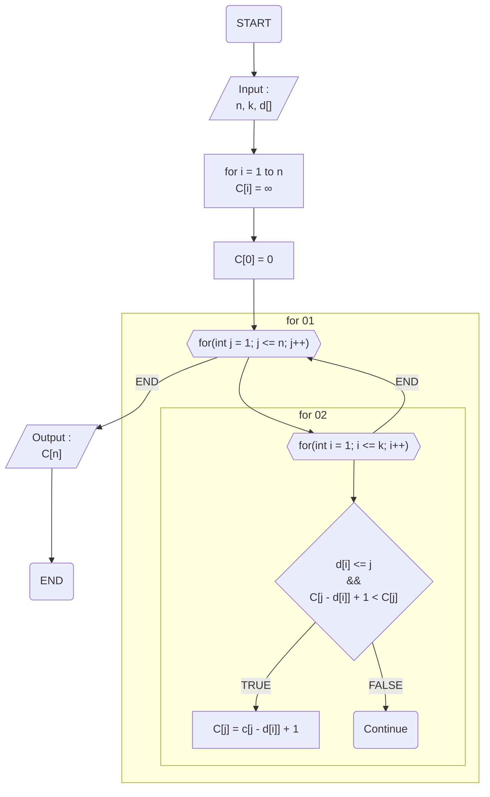

## Levenshtein Distance Algorithm (Edit Distance Algorithm)

- 이벤트 흐름
  - 정상 흐름
    1. 2개의 Input을 받는다.
    2. i = 1로 두고, 1씩 증가시키며 input1의 길이까지 dist[i]\[0] = i로 합니다.
    3. j = 1로 두고, 1씩 증가시키며 input2의 길이까지 dist[0]\[j] = j로 합니다.
    4. j = 1로 두고, 1씩 증가시키며, input2의 길이까지 아래 작업을 반복합니다.
       1. i = 1로 두고, 1씩 증가시키며, input1의 길이까지 아래 작업을 반복합니다.
          1. 만약 input[i - 1] == input2[j - 2]일 경우, dist[i]\[j] = dist[i - 1]\[j - 1]로 합니다.
          2. 아닐 경우, dist[i]\[j] = min(dist[i - 1]\[j - 1] + 1, min(dist[i]\[j - 1] + 1, dist[i - 1]\[j + 1]))로 합니다.
    5. 모든 반복이 끝났다면, dist[intput1.length()]\[input2.length()]를 출력하고 종료합니다.
- 유스케이스 종료
  - 모든 작업을 완료했을 경우 종료된다.
- 사후 조건
  - X

## 0-1 Knapsack Algorithm

- 이벤트 흐름
  - 정상 흐름
    1. 이 흐름을 knapsack으로 정의합니다.
    1. i, W, w, p를 입력받습니다.
    1. i <= 0 이거나 W <= 0인 경우 0을 리턴하고 나옵니다.
    4. w[i] > W인 경우, 아래를 진행합니다.
       1. value에 knapsack(i - 1, W, w, p)의 값을 넣습니다.
       2. i - 1, W, value를 출력합니다.
       3. value를 리턴하고 나옵니다.
    5. w[i] > W가 아닌 경우 (w[i] <= W인 경우), 아래를 진행합니다.
       1. left에 knapsack(i - 1, W, w, p)의 값을 넣습니다.
       2. i - 1, W, left를 출력합니다.
       3. right에 knapsack(i - 1, W - w[i], w, p)의 값을 넣습니다.
       4. i - 1, W - w[i], right를 출력합니다.
       5. max(left, p[i] + right)를 리턴하고 나옵니다.
- 유스케이스 종료
  - 모든 작업을 완료했을 경우 종료된다.
- 사후 조건
  - X

## DP Coin Change Algorithm

- 이벤트 흐름
  - 정상 흐름
    1. C의 각 원소를 ∞으로 설정한다.
    2. C[0] = 0으로 설정한다.
    3. j = 1로 두고, 1씩 증가시키며, n이 될 때 까지 아래를 반복한다.
       1. i = 1로 두고, 1씩 증가시키며, k가 될 때 까지 아래를 반복한다.
          1. 만약 d[i] <= j 이면서 C[j - d[i]] + 1 < C[j]인 경우, C[j] = c[j - d[i]] + 1로 한다.
    4. 모든 반복이 끝나면, C[n]을 출력하고 종료한다.
- 유스케이스 종료
  - 모든 작업을 완료했을 경우 종료된다.
- 사후 조건
  - X

