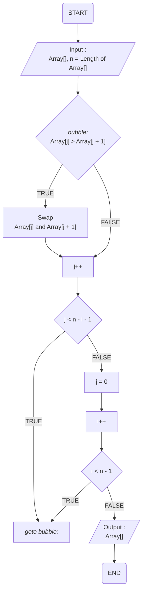
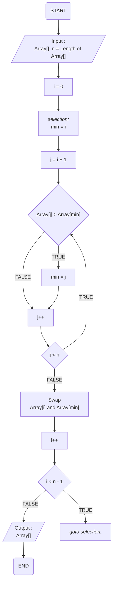
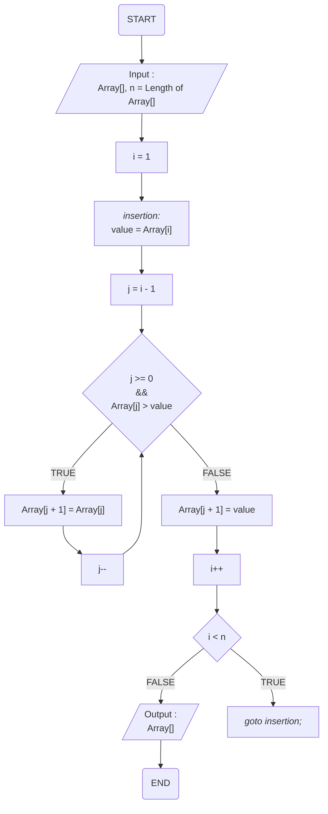
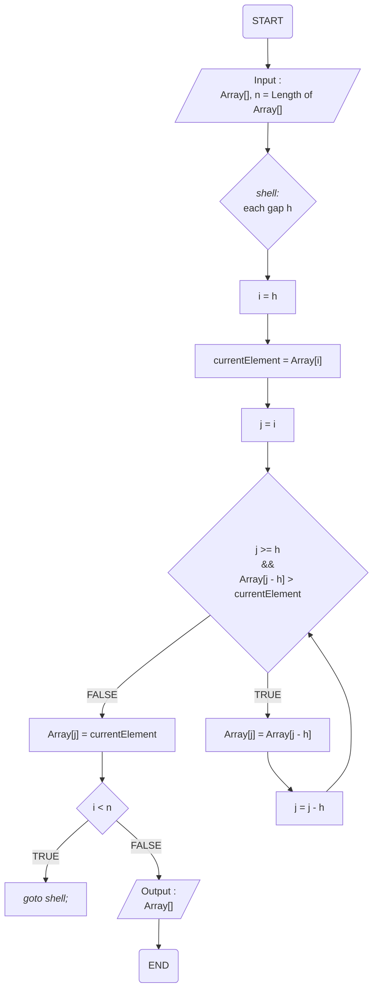
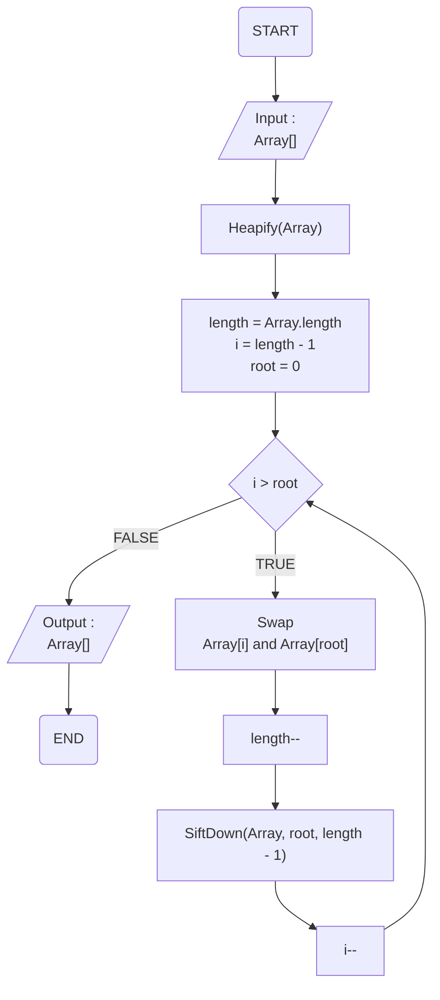
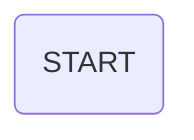
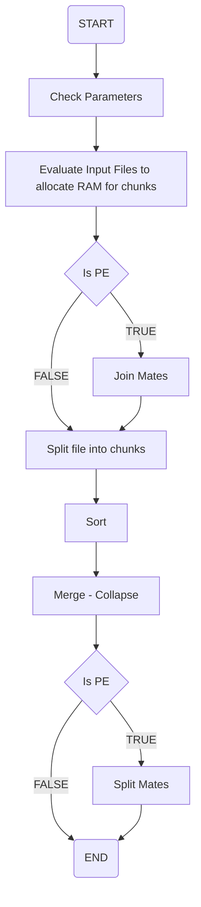

## Bubble Sort Algorithm

- 이벤트 흐름
  - 정상 흐름
    1. n개의 원소를 가진 Array 입력
    2. Array[j] > Array[j + 1]인 경우, Array[j]와 Array[j + 1] 교환
    3. 이후, j에 1을 더한다.
    4. j < n - i - 1인 경우, 2번째 줄로 돌아가 반복
    5. 아닌 경우, j = 0으로 초기화하고, i에 1을 더한다.
    6. i < n - 1인 경우, 2번째 줄로 돌아가 반복
    7. 아닌 경우, 정렬된 Array를 출력하고 종료
- 유스케이스 종료
  - 모든 작업을 완료했을 경우 종료된다.
- 사후 조건
  - X

## Selection Sort Algorithm

- 이벤트 흐름
  - 정상 흐름
    1. n개의 원소를 가진 Array 입력
    2. i = 0
    3. min = i, j = i + 1로 둔다.
    4. Array[j] > Array[min]일 경우, min = j로 둔다.
    5. 이후 j에 1을 더한다.
    6. j < n인 경우, 4번째 줄로 돌아가 반복한다.
    7. 아닌 경우, Array[i]와 Array[min]을 바꾼다.
    8. 이후 i에 1을 더한다.
    9. i < n - 1인 경우, 3번째 줄로 돌아가 반복한다.
    10. 아닌 경우, 정렬된 Array를 출력한다.
- 유스케이스 종료
  - 모든 작업을 완료했을 경우 종료된다.
- 사후 조건
  - X

## Insertion Sort Algorithm

- 이벤트 흐름
  - 정상 흐름
    1. n개의 원소를 가진 Array 입력
    2. i = 1
    3. value = Array[i], j = i - 1로 둔다.
    4. j >= 0 이면서 Array[j] > value인 경우, Array[j + 1] = Array[j]로 두고 j에서 1을 뺀 뒤, 이 줄을 반복한다.
    5. 아닌 경우, Array[j + 1] = value로 둔다.
    6. 이후 i에 1을 더한다.
    7. i < n 인 경우, 3번째 줄로 돌아가 반복한다.
    8. 아닌 경우, 정렬된 Array를 출력한다.
- 유스케이스 종료
  - 모든 작업을 완료했을 경우 종료된다.
- 사후 조건
  - X

## Shell Sort Algorithm

- 이벤트 흐름
  - 정상 흐름
    1. n개의 원소를 가진 Array 입력
    2. 각각의 gap h에 대하여 반복 시작
    3. i = h, currentElement = Array[i], j = i로 둔다.
    4. j >= h이면서 Array[j - h] > currentElement인 경우, Array[j] = Array[j - h]로 하고 j = j - h로 한 뒤 이 줄을 반복한다.
    5. 아닌 경우, Array[j] = currentElement로 둔다.
    6. i < n인 경우, 2번째 줄로 돌아가 반복한다.
    7. 아닌 경우, 정렬된 Array를 출력하고 종료한다.
- 유스케이스 종료
  - 모든 작업을 완료했을 경우 종료된다.
- 사후 조건
  - X

## Heap Sort Algorithm

- 이벤트 흐름
  - 정상 흐름
    1. n개의 원소를 가진 Array[] 입력
    2. Array Heapify 진행
    3. length에 Array.length 대입, i = length - 1, root = 0으로 둔다.
    4. i > root인 경우, Array[i]와 Array[root]를 교환하고, length에서 1을 뺀 뒤, SiftDown(Array, root, length - 1)을 수행한 뒤, i에서 1을 빼고 이 줄을 반복한다.
    5. 아닌 경우, Array를 출력하고 종료한다.
- 유스케이스 종료
  - 모든 작업을 완료했을 경우 종료된다.
- 사후 조건
  - X

## Radix Sort Algorithm

- 이벤트 흐름
  - 정상 흐름
    1. 0~9 까지의 Queue의 Bucket을 준비한다.
    2. 모든 데이터에 대하여 가장 낮은 자릿수에 해당하는 Bucket에 차례대로 데이터를 둔다.
    3. 0부터 차례대로 Bucket에서 데이터를 다시 가져온다.
    4. 가장 높은 자리수를 기준으로 하여, 자릿수를 높여가며, 2번째 3번째 과정을 반복한다.
    5. 모든 반복이 끝나면 정렬된 데이터를 출력한다.
- 유스케이스 종료
  - 모든 작업을 완료했을 경우 종료된다.
- 사후 조건
  - X

## External Sort Algorithm

- 이벤트 흐름
  - 정상 흐름
    1. Input HDD에 저장된 블록 수 > 1인 동안 아래를 반복한다.
       1. Input HDD에 저장된 블록을 2개씩 선택한다.
       2. 각각 블록으로부터 데이터를 부분적으로 읽어드려 합병한다.
       3. 해당 결과를 Output HDD에 저장한다. (단, Input HDD에 저장된 블록 수가 홀수인 경우, 마지막 블록은 Output HDD에 저장)
       4. 이 과정이 끝나면 Output과 Input을 뒤집어 역할을 바꾼다.
    2. 모든 작업이 끝나면 Output HDD를 리턴한다.
- 유스케이스 종료
  - 모든 작업을 완료했을 경우 종료된다.
- 사후 조건
  - X

