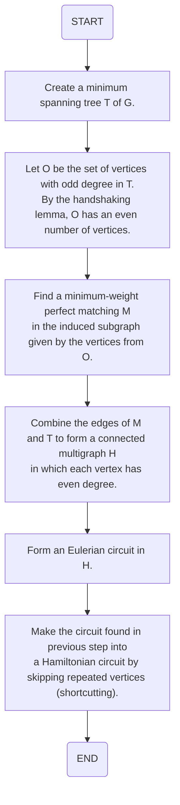
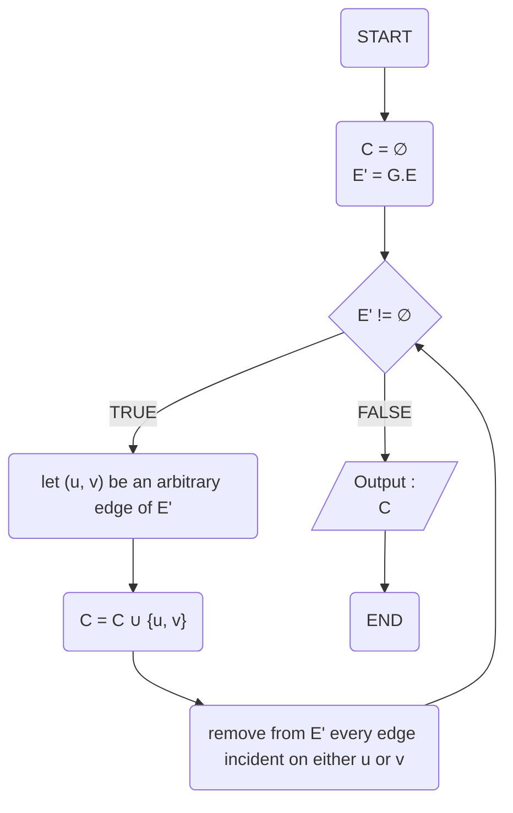
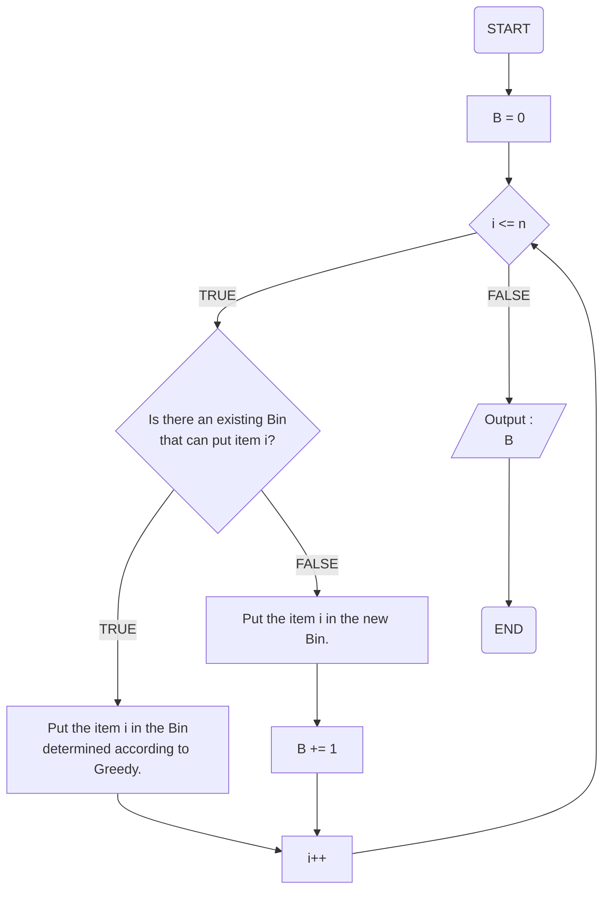
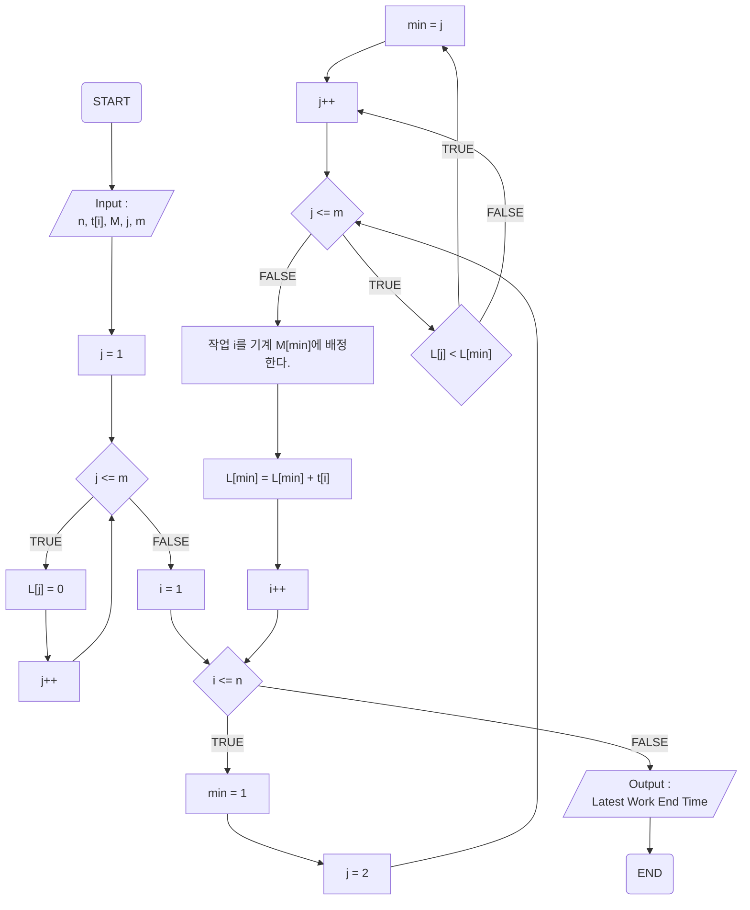

## Graph Coloring

- 그래프 색칠하기란 주어진 그래프 G = (V, E)에서 인접한 점들을 서로 다른 색으로 색칠하는 것이다.

  

- 의사코드

  - ```pseudocode
    1)	집합 c(vj) <- 0 for 1 <= j <= n
    2)	c(v1) <- 1
    3)	for 2 <= j <= n {
    4)		정점 vj를 위한 k > 0인 색을 고릅니다. 이때, 인접한 c(vj) <- min(k ∈ N | k > 0 and c(u) != ̸k ∀u ∈ Avj)
    5)	} 정점 vj 에 반복 종료
    ```


## Set Cover

- 주어진 집합 S = (1, 2, 3, ... , n)에 대해서 S의 부분 집합들이 주어질 때, 이 부분 집합들 중에서 합집합하여 S와 같게 되는 부분 집합들을 집합 커버라고 한다. 이 때 가장 적은 수의 부분 집합으로 이루어진 집합커버를 찾으시오.


- 의사코드

  - ```pseudocode
    SetCover(Set u, Set f)
    {
    	Set cover;
    	while(u.size() != 0)
    	{
    		u의 원소들을 가장 많이 포함하는 집합 si를 f에서 선택.
    		u에서 si 차집합.
    		si를 cover에 추가.
    		si를 f에서 제거
    	}
    	return cover
    }
    ```


## Longest Path

- 주어진 가중치 그래프 G = (V, E)에서 시작점 s에서 도착점 t까지의 가장 긴 경로를 찾는 문제
  - 단, 선분의 가중치는 양수이고, 찾는 경로에는 반복되는 점이 없어야 한다.


- 의사코드

  - ```pseudocode
    class node:
        def longest_path(self):
            if len(self.children) == 0: # No children in this node
                return 1
            child_lengths = []
            for child in self.children:
                child_lengths.append(child.longest_path())
            return max(child_lengths) + 1
    ```

    

## Traveling Salesman Problem

- 주어진 가중치 그래프 G = (V, E)에서, 임의의 한 점에서 출발하여, 다른 모든 점들을 1번씩만 방문하고, 다시 시작점으로 돌아오는 경로 중에서 최단 경로를 찾는 문제


- 의사코드

  - ```pseudocode
    Visited[N] = 0;
    Cost = 0;
    
    Procedure TSP(N, s)
    	Visited[s] = 1;
    	if |N| = 2 and k != s then
    		Cost(N, k) = dist(s, k);
    		return Cost;
    	else
    		for j ∈ N do
    			for i ∈ N and Visited[i] = 0 do
    				if j != i and j != s then
    					Cost(N, j) = min(TSP(N - {i}, j) + dist(j, i))
    					Visited[j] = 1;
    				end
    			end
    		end
    	end	
    	return cost;
    end
    ```

    

## Hamiltonian Cycle

- 주어진 그래프 G = (V, E)에서, 임의의 한 점에서 출발하여 모든 다른 점들을 1번씩만 방문하고, 다시 시작점으로 돌아오는 경로를 찾는 문제


- 의사코드

  - ```pseudocode
    Begin
       if all nodes are included, then
          if there is an edge between nodes k and 0, then
             return true
          else
             return false;
    
       for all vertex v except starting point, do
          if isValid(v, k), then //when v is a valid edge
             add v into the path
             if cycleFound(k+1) is true, then
                return true
             otherwise remove v from the path
       done
       return false
    End
    ```

    

## Bin Packing

- n개의 물건이 주어지고, bin의 용량이 c일 때, 가장 적은 수의 통을 사용하여 모든 물건을 통에 채우는 문제


- 의사코드

  - ```pseudocode
    item(1)을 새로운 Bin(1)에 채운다.
    for (i=2; i<=item 개수; i++) {
        for (j=1; j<=Bin갯수: j++) { // 항상 처음 Bin부터
            if (item(i).Size <= Bin(j).남은공간Size) {
                // item(i)를 채울 수 있는 Bin(j) 탐색
                Bin(j)에 item(i)를 채운다;
                exit for;
            }
        }
        if (마지막 Bin까지 탐색해도 채울 수 없었으면) {
            새로운 Bin(j+1)을 생성하고 item(i)를 채운다;
        }
    }
    ```

    

## Job Scheduling

- n개의 작업,각 적업의 수행 시간 ti, 단, i = 1, 2, 3, ..., n, 그리고 m개의 동일한 선능의 기계가 주어질 때, 모든 작업이 가장 빨리 종료되도록 작업을 기계에 배정하는 문제


- 의사코드

  - ```pseudocode
    JobScheduling(Task *arr)
    {
      Task list[] = arr를 시작 시간을 기준으로 오름차순 정렬한 배열
      while (list에 원소가 존재하면)
      {
        t_i = (가장 이른 시작 시간을 가진 작업);
        if (t_i를 수행할 기계가 존재하면)
          t_i를 해당 기계에 배정한다.
        else
          새로운 기계에 t_i를 배정한다.
        t_i를 list에서 제거한다.
      }
      return 각 기계에 배정된 작업 순서
    }
    ```

    

## Approx MST TSP

- 이벤트 흐름
  - 정상 흐름
    1. G의 최소 비용 신장 트리 T를 구한다.
    2. T의 홀수 차수 점들의 집합을 O라고 정의하면, O는 약수 보조 정리에 의해 짝수개의 원소를 가지게 된다.
    3. O에 의해 형성된 유도 부분 그래프에서 최소 비용의 완벽 부합 M을 찾는다.
    4. M과 T의 변들을 합쳐 모든 점들이 짝수 차수를 갖는 다중 그래프 H를 형성한다.
    5. H에서 오일러 회로를 구성한다.
    6. 5단계에서 찾은 회로에서 반복되는 점들을 제거하여 해밀턴 회로로 변경한다.
- 유스케이스 종료
  - 모든 작업을 완료했을 경우 종료된다.
- 사후 조건
  - X





## Approx Matching VC

- 이벤트 흐름
  - 정상 흐름
    1. E'가 공집합이 아닌 동안 아래를 반복한다.
       1. E'의 임의의 간선 (u, v)를 뽑는다.
       2. C = C ∪ {u, v}
       3. u 혹은 v가 포함된 E`의 모든 간선을 제거한다.
    2. C를 출력한다.
- 유스케이스 종료
  - 모든 작업을 완료했을 경우 종료된다.
- 사후 조건
  - X





## Approx Bin Packing

- 이벤트 흐름
  - 정상 흐름
    1. 아래를 i가 1부터 n이 될 때 까지 1씩 증가시키며 반복한다.
       1. 만약 물건 i를 넣을 여유가 있는 기존의 통이 있다면
          1. 그리디에 따라 정해진 통에 물건 i를 넣는다.
       2. 없다면 새 통에 물건 i를 넣고 통의 수를 1 늘린다.
    2. 모든 반복이 끝나면 통의 갯수를 출력한다.
- 유스케이스 종료
  - 모든 작업을 완료했을 경우 종료된다.
- 사후 조건
  - X





## Approx Job Scheduling

- 이벤트 흐름
  - 정상 흐름
    1. 아래를 j가 1부터 m이 될 때 까지 1씩 증가시키며 반복한다.
       1. L[j] = 0
    2. 아래를 i가 1부터 n이 될 때 까지 1씩 증가시키며 반복한다.
       1. min = 1
       2. 아래를 j가 2부터 m이 될 때 까지 1씩 증가시키며 반복한다.
          1. 만약 L[j] < L[min]인 경우 min = j으로 한다.
       3. 작업 u를 기계 M[min]에 배정한다.
       4. L[min] = L[min] + ti
    3. 가장 늦은 작업 종료 시작을 출력한다.
- 유스케이스 종료
  - 모든 작업을 완료했을 경우 종료된다.
- 사후 조건
  - X




